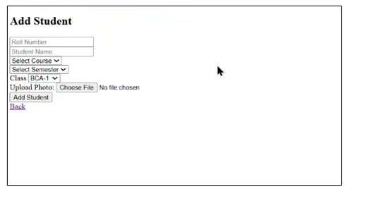
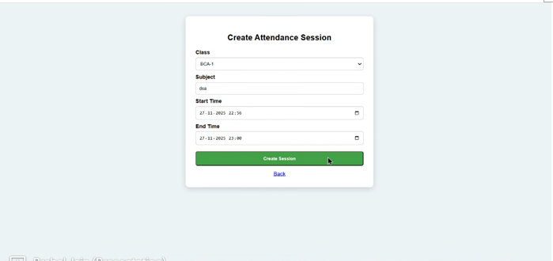

# 🎯 Facial Attendance Monitoring System

## 📖 Overview

The Facial Attendance Monitoring System is a **real-time face recognition-based attendance system** built using **Python, OpenCV, Flask, and MySQL**.
It automates attendance tracking by detecting and recognizing faces through a webcam.

---

## 🚀 Features

* 📷 Face Detection & Recognition using OpenCV
* 📝 Automatic Attendance Marking with Date & Time
* 🗄️ MySQL Database Integration
* 🔐 Secure and Contactless System
* 📊 Dashboard for Attendance Records
* 🔍 Search Functionality for Attendance

---

## 🛠️ Tech Stack

* **Frontend:** HTML, CSS
* **Backend:** Python (Flask)
* **Computer Vision:** OpenCV
* **Database:** MySQL

---

## ⚙️ Installation & Setup

### 1️⃣ Clone the repository

```bash
git clone https://github.com/Prabal24/Facial-Attendance-Monitoring-System.git
cd Facial-Attendance-Monitoring-System
```

### 2️⃣ Install dependencies

```bash
pip install opencv-python numpy flask pymysql
```

### 3️⃣ Run the project

```bash
python app.py
```

---

## ⚙️ How It Works

1. Register user face
2. Capture face dataset
3. Train the model
4. Start camera for attendance
5. System detects and recognizes face
6. Attendance is marked automatically in database

---

## 📸 Screenshots

### 🎥 Add Student



---

### 📊 Dashboard


---

### 🔐 Login Page


---

### 🧾 Create Session



---

## 📌 Future Improvements

* Face mask detection
* Mobile app integration
* Cloud database support
* Advanced analytics dashboard

---

## 👨‍💻 Author

**Prabal Jain**

🔗 GitHub: https://github.com/Prabal24

---

## ⭐ Support

If you like this project, give it a ⭐ on GitHub!
